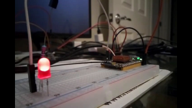

User Space IO is Python 3 and Java 8 bindings for Linux user space GPIO, SPI,
I2C, PWM and Serial interfaces. Using best of breed user space C libraries
provides a cross platform solution to SBC development. Primarly User Space IO
will be targeting [Armbian](https://www.armbian.com), but the scripts should
work with most Ubuntu/Debian distributions. Demo applications are included that
illustrate how to leverage the bindings.

The idea is to have consistent APIs across C, Python and JVM languages without
having to use hacked up RPi.GPIO or Wiring Pi implementations for each distinct
SBC model. The possibility of using other JVM based languages such as Groovy,
Kotlin, Scala, etc. opens up language opprtunties that do not currently exist
in the IoT space.

### SBC configuration
* If you are using Armbian then use armbian-config or edit `/boot/armbianEnv.txt`
to configure various devices. User space devices are exposed through /dev or
/sys. Verify the device is showing up prior to trying demo programs.
* If you are not using Armbian then you will need to know how to configure
devices to be exposed to user space for your Linux distribution and SBC model.
Check each log to be sure there were no errors after running install.sh. Submit
a PR if you would like a different distribution supported. Conditionals can be
added to the current scripts to handle different detectable distributions. 
* You need kernel 4.8 or greater to use libgpiod.
* Non-root access works for everything except PWM. I'm working on a solution
for this.
* I have tested NanoPi Duo v1.1 for 32 bit and NanoPi Neo 2 Plus for 64 bit using
the latest Armbian release. The ability to switch seemlessly between 32 and 64
bit platforms gives you a wide range of SBC choices.

### Python bindings notes
[CFFI](https://cffi.readthedocs.io/en/latest) is used to create the Python 3
bindings. Some macros and a few functions would not work with CFFI's cdef.
These are noted below and do no impact functionality.

### Java bindings notes
[JNAerator](https://github.com/nativelibs4java/JNAerator) is used to create
Java bindings from the C header files. I added some post generation patching
(see java-bindings.sh) to fix a couple of issues with the generated code.
**Note:** JNAerator fails on ARMv8 (64 bit) with "architecture word width
mismatch" because there is no ARMv8 version of the native library libbridj.so.
This is not an issue since the Java bytecode compiled on ARMv7 works without
the need to recompile. The wrapper script skips the JNAerator steps and just
compiles the demos with the precompiled jars included in the project.

## Download project
* `cd ~/`
* `git clone --depth 1 https://github.com/sgjava/userspaceio.git`

## Install script
* `cd ~/userspaceio`
* `./install.sh`
* Check various log files if you have issues running the demo code. Something
could have gone wrong during the build/bindings generation processes.

## Non-root access
If you want to access devices without root do the following (you can try udev
rules instead if you wish):
* `sudo usermod -a -G dialout username` (Use a non-root username)
* `sudo groupadd i2c`
* `sudo usermod -a -G i2c username` (Use a non-root username)
* `sudo groupadd spi`
* `sudo usermod -a -G spi username` (Use a non-root username)
* `sudo groupadd gpio`
* `sudo usermod -a -G gpio username` (Use a non-root username)
* `sudo gpiodetect` (Note chip names to add below for libgpiod access)
* `ls /dev/spidev*` (Note SPI channels below)
* `ls /dev/i2c*` (Note i2c devices below)
* `sudo nano /etc/rc.local`
<pre><code>chown -R root:gpio /dev/gpiochip0
chmod -R ug+rw /dev/gpiochip0
chown -R root:gpio /dev/gpiochip1
chmod -R ug+rw /dev/gpiochip1
chown -R root:i2c /dev/i2c-0
chmod -R ug+rw /dev/i2c-0
chown -R root:spi /dev/spidev1.0
chmod -R ug+rw /dev/spidev1.0</code></pre>

## libgpiod
[libgpiod](https://git.kernel.org/pub/scm/libs/libgpiod/libgpiod.git/tree/README)
is a C library and tools for interacting with the linux GPIO character device.
Since linux 4.8 the GPIO sysfs interface is deprecated. User space should use
the character device instead. libgpiod encapsulates the ioctl calls and data
structures behind a straightforward API. **Note:** Edit `usegitrepo` in
[install.sh](https://github.com/sgjava/userspaceio/blob/master/libgpiod/install.sh)
to use libgpiod-1.0.tar.gz (defaut) or git branch v1.0.x.

Since libgpiod is not currently present in most Linux distributions you need to
build it from source. This project automates the build process on Armbian, but
also includes the steps to build manually on your faviorite Linux distribution.

#### Build manually
Here are the steps to build libgpiod manually.
* Flash Armbian or other distribution with mainline kernel (kernel must be >= 4.8)
    * `ls /dev/gpiochip*`
         * If you get results then proceed or else get a proper kernel
    * `apt-get update`
    * `apt-get upgrade`
* sudo armbian-config (or download Linux headers manually for your distribution)
    * Software
    * Headers
    * You can also try `sudo apt-get install linux-headers-$BRANCH-$LINUXFAMILY`
* `sudo apt-get install libtool pkg-config`
* `git clone https://git.kernel.org/pub/scm/libs/libgpiod/libgpiod.git`
* `cd libgpiod`
* `mkdir -p include/linux`
* `cp /usr/src/linux-headers-$(uname -r)/include/linux/compiler_types.h include/linux/.`
* `./autogen.sh --enable-tools=yes --prefix=/usr/local CFLAGS="-I/usr/src/linux-headers-$(uname -r)/include/uapi -Iinclude"`
    * If you get errors check config.log and try to correct before creating any Github issues
* `make`
* `sudo make install`
* `sudo ldconfig`

#### How pins are mapped
This is based on testing on a NanoPi Duo. gpiochip0 starts at 0 and gpiochip1
start at 352. Consider the following examples:

|Name                           |Chip Name |Line|sysfs|
| ----------------------------- | -------- | -- | --- |
|DEBUG_TX(UART_TXD0)/GPIOA4     |gpiochip0 | 004|  004|
|DEBUG_RX(UART_RXD0)/GPIOA5/PWM0|gpiochip0 | 005|  005|
|I2C0_SCL/GPIOA11               |gpiochip0 | 011|  011|
|I2C0_SDA/GPIOA12               |gpiochip0 | 012|  012|
|UART3_TX/SPI1_CS/GPIOA13       |gpiochip0 | 013|  013|
|UART3_RX/SPI1_CLK/GPIOA14      |gpiochip0 | 014|  014|
|UART3_RTS/SPI1_MOSI/GPIOA15    |gpiochip0 | 015|  015|
|UART3_CTS/SPI1_MISO/GPIOA16    |gpiochip0 | 016|  016|
|UART1_TX/GPIOG6                |gpiochip0 | 198|  198|
|UART1_RX/GPIOG7                |gpiochip0 | 199|  199|
|GPIOG11                        |gpiochip0 | 203|  203|
|ON BOARD BUTTON                |gpiochip1 | 003|  355|
|GPIOL11/IR-RX                  |gpiochip1 | 011|  363|

So basically you just need to know the starting number for each chip and realize
libgpiod always starts at 0 and calculate the offset. Thus gpiochip1 starts at
352 and the on board button is at 355, so 355 - 352 = 3 for libgpiod.

#### Python bindings
Some macros and a few functions would not work with CFFI's cdef. These were
bulk functions that can be simulated in Python:
* static inline void gpiod_line_bulk_init(struct gpiod_line_bulk *bulk)
* static inline void gpiod_line_bulk_add(struct gpiod_line_bulk *bulk,
* static inline struct gpiod_line *gpiod_line_bulk_get_line(struct gpiod_line_bulk *bulk, unsigned int offset)
* static inline unsigned int gpiod_line_bulk_num_lines(struct gpiod_line_bulk *bulk)

To run demos:
* `alias python=python3`
* `cd ~/userspaceio/libgpiod/python/src`
* `python ledtest.py --chip 0 --line 203` to run LED test after wiring up to
line 203 (GPIOG11) on NanoPi Duo (the default). 

#### Java bindings
To run demos:
* `cd ~/userspaceio/libgpiod/java`
* `java -Djava.library.path=/usr/local/lib -cp ../../jnaerator/jna-4.5.0.jar:../../jnaerator/jnaerator-runtime.jar:libgpiod.jar:demo.jar com.codeferm.demo.LedTest 0 203`
to run LED test after wiring up to line 203 (GPIOG11) on NanoPi Duo (the default). 

## c-periphery
[c-periphery](https://github.com/vsergeev/c-periphery) is used to provide SPI,
I2C and Serial interfaces. I did not use the GPIO because it is based on the
oudated sysfs interface. Also the MMIO was not used since it requires a AM335x
processor. Helper methods were added to the objects to remove some repetitive
operations (i.e. building I2C messages to read/write registers).

#### Python bindings
To run demos:
* `alias python=python3`
* `cd ~/userspaceio/c-periphery/python/src`
* `python spiloopback.py  --device /dev/spidev1.0 --maxSpeed 500000` to run
SPI loop back on NanoPi Duo (the default). Use a jumper wire between MI and MO. 

#### Java bindings
To run demos:
* `cd ~/userspaceio/c-periphery/java`
* `java -Djava.library.path=/usr/local/lib -cp ../../jnaerator/jna-4.5.0.jar:../../jnaerator/jnaerator-runtime.jar:libperiphery.jar:demo.jar com.codeferm.demo.Mpu6050`
to run Triple Axis Accelerometer & Gyro MPU-6050 sensor example. 

## pwmio
I wasn't able to find a good C library that handled hardware PWM, so I worte one
based on /sys/class/pwm. Currently I'm unable to get /sys/class/pwm working
without root access. I will continue to explore how to do this.

#### Python bindings
To run demos:
* `cd ~/userspaceio/pwmio/python/src`
* `sudo python3 ledflash.py  --device 0 --pwm 0` to run
I wired up the LED to the PWM pin. 

#### Java bindings
To run demos:
* `cd ~/userspaceio/pwmio/java`
* `sudo java -Djava.library.path=/usr/local/lib -cp ../../jnaerator/jna-4.5.0.jar:../../jnaerator/jnaerator-runtime.jar:libpwmio.jar:demo.jar com.codeferm.demo.LedFlash`
to make LED flash and increase intensity. 

### References
* [libgpiod](https://git.kernel.org/pub/scm/libs/libgpiod/libgpiod.git/tree/README)
* [c-periphery](https://github.com/vsergeev/c-periphery)
* [Learn More About Linux’s New GPIO User Space Subsystem & Libgpiod](https://www.cnx-software.com/2017/11/03/learn-more-about-linuxs-new-gpio-user-space-subsystem-libgpiod)
